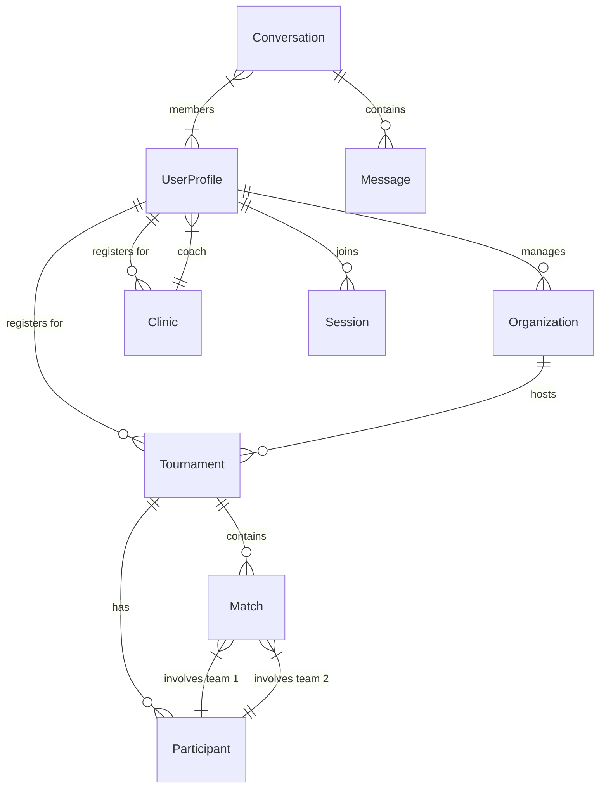

# 3.3 Database Schema

## Overview

The NNS platform uses a relational database schema (PostgreSQL) managed via Supabase. The schema is designed to support the complex relationships between users, tournaments, organizations, and game data.

> **Note**: The definitive source of truth for the type definitions in the codebase is `src/lib/types.ts`. This document provides a conceptual overview and documentation of the schema derived from those types.

## Core Entities

### Users & Profiles (`UserProfile`)

The central entity representing a registered user.

- **`id`** (UUID, PK): Unique identifier (mapped from Auth Provider).
- **`roles`** (Array): Roles assigned to the user (`admin`, `organizer`, `player`, `coach`).
- **`email`**, `firstName`, `lastName`: PII.
- **`skillRating`** (JSONB): Contains the Glicko-2 rating data (`rating`, `ratingDeviation`, `volatility`).
- **Stats**: Aggregated storage for `matchesWon`, `matchesLost`, `courtTimeHours` etc.
- **Social**: Arrays for `followingIds` and `followerIds`.

### Organizations (`Organization`)

Represents a club, league, or entity that hosts events.

- **`id`** (UUID, PK): Unique identifier.
- **`ownerId`** (UUID, FK): The user who owns/manages the organization.
- **`organizerIds`** (Array of UUIDs): Users with admin rights for this org.
- **`type`**: E.g., 'tournament', 'club'.
- **`tournamentFormats`**: Supported game formats.

### Tournaments (`Tournament`)

The core event entity.

- **`id`** (UUID, PK): Unique identifier.
- **`organizationId`** (FK): The hosting organization.
- **`registrations`** (JSONB/Relation): List of `Participant` objects (Teams or Individuals).
- **`format`**: E.g., 'mens_doubles', 'coed_fours'.
- **`poolStructure`** (JSONB): Configuration for pool sizes and waves.
- **`seedingFormat`**: Rules for seeding games (points per game, cap).
- **`playoffConfig`**: Rules for playoff brackets (elimination type, tiers).

### Matches (`Match`)

Represents a single game within a tournament.

- **`id`** (Integer/UUID): Unique identifier.
- **`tournamentId`** (FK): Parent tournament.
- **`pool`**: Identifier if part of pool play.
- **`bracketId`**: Identifier if part of playoffs.
- **`participants`**: The two teams competing.
- **`scores`**: Array of `MatchScore` objects.
- **`winner`**: The winning participant.
- **`status`**: State of the match (`pending`, `ready`, `in_progress`, `finished`).

## Supporting Entities

### Clinics (`Clinic`)

Coaching events.

- **`coachId`** (FK): The instructor.
- **`registeredPlayerIds`**: List of attendees.
- **`price`**, `date`, `location`.

### Sessions (`Session`)

Pickup or open play sessions.

- **`hostId`** (FK): The creator.
- **`level`**: Skill level restriction (`open`, `aa`, `b`).
- **`visibility`**: `public`, `followers`, or `private`.
- **`acceptedPlayerIds`**: Confirmed attendees.

### Messaging

- **`Conversation`**: A chat thread (`direct`, `group`, `event`).
  - **`members`**: User IDs in the chat.
  - **`relatedEventId`**: Links chat to a Tournament or Clinic.
- **`Message`**: Individual message.
  - **`conversationId`** (FK).
  - **`senderId`** (FK).
  - **`text`**, `attachments`.

### Ratings (`UserRatingHistory`)

Audit log for rating changes.

- **`userId`** (FK).
- **`tournamentId`** (FK): Source of the rating change.
- **`oldRating`**, `newRating`, `change`.

## Relationships (ERD Concept)

## Security Policies (RLS)

Although not strictly part of the schema definition, Row Level Security (RLS) policies in Supabase are crucial:

- **Public Read**: Most tournament and profile data is publicly readable.
- **Authenticated Write**: Users can only update their own profiles.
- **Owner Write**: Organization admins can only edit their own tournaments.
- **Private Data**: Email addresses and phone numbers are protected and only visible to authorized users (admins/organizers of events the user registered for).
